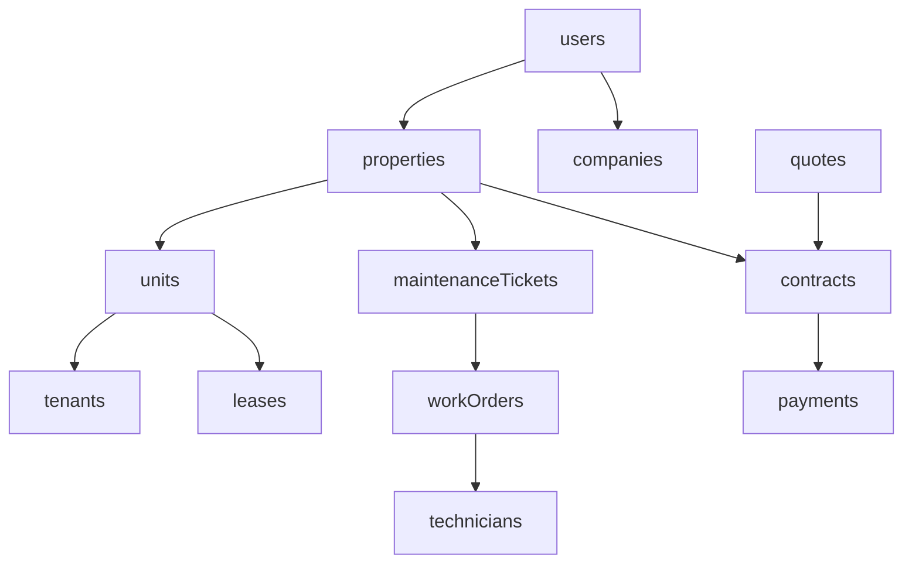

# BIN Group OS: Firebase Architecture & Schema (v3.0)

This document defines the master backbone of the BIN Group Super App. It uses a Cloud Firestore document-collection model optimized for scalability, real-time analytics, and role-based operational workflows in the UAE PropTech market.

---

## 🏗️ 1. Core Identity & Organization

### 👥 `users` (Collection)
*Universal identity base for all roles.*
*   **ID**: `userId` (Firebase Auth UID)
*   **Fields**: `name`, `email`, `phone` (+971), `role` (owner/tenant/tech/admin), `companyId`, `createdAt`, `walletBalance`.

### 🏢 `companies` (Collection)
*Corporate entities and internal BIN Group divisions.*
*   **ID**: `companyId`
*   **Fields**: `companyName`, `tradeLicense` (UAE-XXXX), `city`, `country`: "UAE", `createdAt`.

---

## 🏙️ 2. Property & Asset Management

### 🏗️ `properties` (Collection)
*Digital twin for entire buildings or complexes.*
*   **ID**: `propertyId`
*   **Fields**: `propertyName`, `propertyType` (Tower/Mall/Villa), `assetClass` (Residential/Commercial/Institutional/Industrial), `ownerId`, `address`, `city`, `totalAreaSqft`, `totalUnits`, `floors`, `yearBuilt`, `annualRent`, `location` (GeoPoint).
*   **Sector Signals**: `liftCount`, `hvacTopology`, `occupancyRatio`, `tenantChurn`, `inspectionCompliance`, `serviceRecurrenceIndex`.

### 🏘️ `units` (Collection)
*Individual apartments, offices, or retail shells.*
*   **ID**: `unitId`
*   **Fields**: `propertyId`, `unitNumber`, `floor`, `type`, `sizeSqft`, `tenantId`, `rent`.
*   **Optimization**: For buildings with 300+ units, these are stored as sub-collections under the parent property.

### 🛠️ `assets` (Collection)
*Lifecycle tracking for physical equipment (AC, Pumps, Elevators).*
*   **Fields**: `assetId`, `propertyId`, `unitId`, `name`, `model`, `installedAt`, `expectedLife` (months), `lastService`.

---

## 👥 3. Tenant & Lease Ecosystem

### 👤 `tenants` (Collection)
*Resident profiles and behavioral data.*
*   **ID**: `tenantId` (Matches `users.uid`)
*   **Fields**: `name`, `phone`, `email`, `currentUnitId`, `activeLeaseId`.

### 📑 `leases` (Collection)
*Legal rental contracts and payment schedules.*
*   **ID**: `leaseId`
*   **Fields**: `propertyId`, `unitId`, `tenantId`, `annualRent`, `startDate`, `endDate`, `status` (active/expired).

---

## 🛠️ 4. Maintenance & Field Operations

### 🎫 `maintenanceTickets` (Collection)
*Reporting layer for tenants and owners.*
*   **ID**: `ticketId`
*   **Fields**: `propertyId`, `unitId`, `tenantId`, `issueType`, `description`, `priority` (Routine/Emergency), `status`, `createdAt`.

### 🧑‍🔧 `technicians` (Collection)
*Field agent management and live tracking.*
*   **ID**: `techId` (Matches `users.uid`)
*   **Fields**: `name`, `phone`, `skill` (HVAC/MEP), `status` (Available/On-Job), `gpsLocation`.

### 📅 `workOrders` (Collection)
*Execution layer for technicians.*
*   **ID**: `orderId`
*   **Fields**: `ticketId`, `techId`, `propertyId`, `scheduledDate`, `status` (In-Progress/Completed), `proofPhotos`.

---

## 📑 5. Financials & Quotations

### 🧾 `contracts` (Collection)
*Signed B2B/B2C service agreements.*
*   **ID**: `contractId`
*   **Fields**: `propertyId`, `contractType` (IFM/PM/Integrated), `maintenanceFee`, `managementFee`, `totalContract`, `startDate`, `endDate`.

### 🧮 `quotes` (Collection)
*Outputs from the 12-Factor Quote Engine.*
*   **ID**: `quoteId`
*   **Fields**: `propertyType`, `areaSqft`, `floors`, `units`, `estimatedMaintenance`, `estimatedManagement`, `integratedPrice`, `recommendedPlan`, `roiIntegrityScore`.

### 💰 `payments` (Collection)
*Transactional ledger.*
*   **ID**: `paymentId`
*   **Fields**: `propertyId`, `contractId`, `amount` (AED), `type` (Rent/FM/Fee), `method`, `status`, `paidDate`.

---

## 📡 6. Smart Building & ESG Ecosystem

### 🔌 `iot_telemetry` (Collection)
*Real-time sensor data from linked buildings.*
*   **Fields**: `assetId`, `propertyId`, `timestamp`, `type` (temp/leak/power/vibration), `value`, `status` (normal/alert).

### 🌳 `sustainability_logs` (Collection)
*ESG and energy tracking data.*
*   **Fields**: `propertyId`, `period` (YYYY-MM), `energyKWh`, `waterM3`, `carbonFootprint`, `esgScore`.

### 🔗 `blockchain_proofs` (Collection)
*Immutable audit trail for SLAs and contracts.*
*   **Fields**: `entityId` (contractId/woId), `ipfsHash`, `txHash`, `network`, `timestamp`.

---

## ⚙️ 7. System Configuration

### 🏷️ `pricing` (Collection)
*Global configuration for the Professional FM Quote Engine.*

#### 📄 `serviceRates` (Document)
| Field | Type | Notes |
| :--- | :--- | :--- |
| `villaRateMin` / `Max` | Number | 8 – 12 AED/sqft |
| `midResidentialRateMin` / `Max` | Number | 8 – 18 AED/sqft |
| `premiumResidentialRateMin` / `Max` | Number | 18 – 28 AED/sqft |
| `luxuryResidentialRateMin` / `Max` | Number | 25 – 40 AED/sqft |
| `commercialRateMin` / `Max` | Number | 12 – 30 AED/sqft |
| `mallRateMin` / `Max` | Number | 25 – 45 AED/sqft |
| `warehouseRateMin` / `Max` | Number | 3 – 6 AED/sqft |
| `mgmtFeeResidential` | Number | 0.05 (Default) |
| `mgmtFeeVilla` | Number | 0.07 |
| `mgmtFeeCommercial` | Number | 0.08 |
| `portfolioDiscounts` | Map | Keys: "5", "10", "15", "20" with values. |
| `termDiscounts` | Map | Keys: "1", "2", "3" (Years) with values (e.g., 0.05 for 3yr). |
| `amenityModifiers` | Map | Factors for Pool (+0.03), Gym (+0.02), etc. |
| `upsellMultipliers` | Map | Predictive AI, IoT, etc. |
| `staffingBenchmarks` | Map | Role-based monthly budgets. |

---

## 📊 Database Relationship Map

---

## 🔐 Security & Optimization
*   **Sub-collections**: Used for history logs (e.g., `maintenanceTickets/{id}/comments`) to keep documents under the 1MB limit.
*   **Indexing**: Composite indexes are required for filtering `maintenanceTickets` by `status` AND `propertyId`.
*   **Residency**: Data remains on UAE-based nodes to comply with PDPL.
