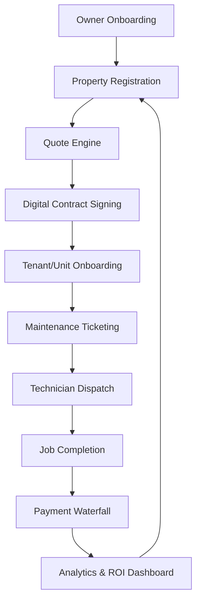

# BIN Group: Complete Operational Workflow

This document outlines the end-to-end operational lifecycle within the BIN Group Super App. It defines how a property is onboarded, quoted, contracted, and managed through automated technical and financial workflows.

---

## 🧭 The 10 Phases of the BIN Group Ecosystem

### 1️⃣ Phase 1: Owner Onboarding
The entry point for landlords and institutional investors.
*   **Action**: Account creation via mobile/web.
*   **Inputs**: Name, Phone (+971 OTP), Email, Company details.
*   **Verification**: Identity verification (Emirates ID/Trade License) to unlock financial authority.

### 2️⃣ Phase 2: Property Registration (Digital Twin Creation)
Establishing the asset in the database.
*   **Action**: Owner "Adds Property" via the wizard.
*   **Inputs**: Property Type, Area (Sqft/m²), Floors, Units, Building Age, HVAC Type, Facilities (Pool/Gym).
*   **Result**: A new record in the `properties` collection.

### 3️⃣ Phase 3: The 12-Factor Quote Engine
Instant commercial transparency.
*   **Action**: Trigger "Get Maintenance Quote".
*   **Logic**: Runs the [Professional FM Tender Algorithm](./PRICING_STRATEGY_UAE.md).
*   **Output**: Comparison of Maintenance-Only, Property Management, and Integrated Package prices.
*   **UX**: Recommends the "Integrated Plan" for maximum yield protection.

### 4️⃣ Phase 4: Digital Contract Signing
Closing the deal instantly.
*   **Action**: Review Terms, SLA, and Pricing.
*   **Execution**: Digital signature directly in the app.
*   **Result**: PDF Generated, stored in `contracts`, and status set to `ACTIVE`.

### 5️⃣ Phase 5: Tenant & Unit Onboarding
Activating the building's population.
*   **Action**: Owner/Admin adds individual units and invites tenants.
*   **Invitation**: Tenants receive SMS/Email with app download link.
*   **Result**: Units and Tenants linked to the Property ID.

### 6️⃣ Phase 6: Maintenance & AI Triage
*   **Trigger**: Tenant reports an issue (e.g., "AC Failure").
*   **AI Analysis**: System analyzes photo/video data to predict fault type.
*   **Urgency Gate**: If "Fire/Gas" detected, auto-redirect to 999.
*   **Routing**: **AI Delegated Routing** assigns the best proximity-based technician.

### 7️⃣ Phase 7: Technician Operation ("No-Photo, No-Pay")
*   **Standard**: Hard-locked photo verification for job commencement and closure.
*   **SLA Enforcement**: Automated penalties/credits triggered if response time exceeds contract thresholds.
*   **Result**: Validated `Completed` status triggers vendor payout.

### 8️⃣ Phase 8: Hybrid Revenue & Financial Waterfall
*   **Leasing Mode**: Owner toggles units between Long-Term (Annual) or **Short-Term (Holiday Home)** modes.
*   **Rent Collection**: Automated from Tenants with **Ejari-synchronized** records.
*   **Payout**: `Rent - (FM Fee + PM Fee + Marketplace Commission) = Net Payout`.

### 9️⃣ Phase 9: Real-Time Intelligence & ESG
*   **IoT Pulse**: Live health monitoring of building assets (Sensors detect leaks before tenants do).
*   **Sustainability**: Real-time Carbon and Energy tracking for ESG compliance.
*   **ROI Dashboard**: Predictive ROI forecasting and Cap Rate analysis.

### 🔟 Phase 10: Regulatory Automation & Compliance
*   **GovBridge**: Automated Ejari registration and DEWA clearance tracking.
*   **Digital Lifecycle**: Continuous AI indexing and legal reminder automation for every unit.

---

## 📊 Visual Platform Flow

---

## 🚀 Strategic Goal: The "Visitor to Contract" Machine
The primary objective of this workflow is to reduce the time from **Visitor** to **Active Contract** from 7 days (manual industry average) to **< 5 minutes**. Automated quoting and digital signing are the "Money Machine" of the BIN Group platform.
