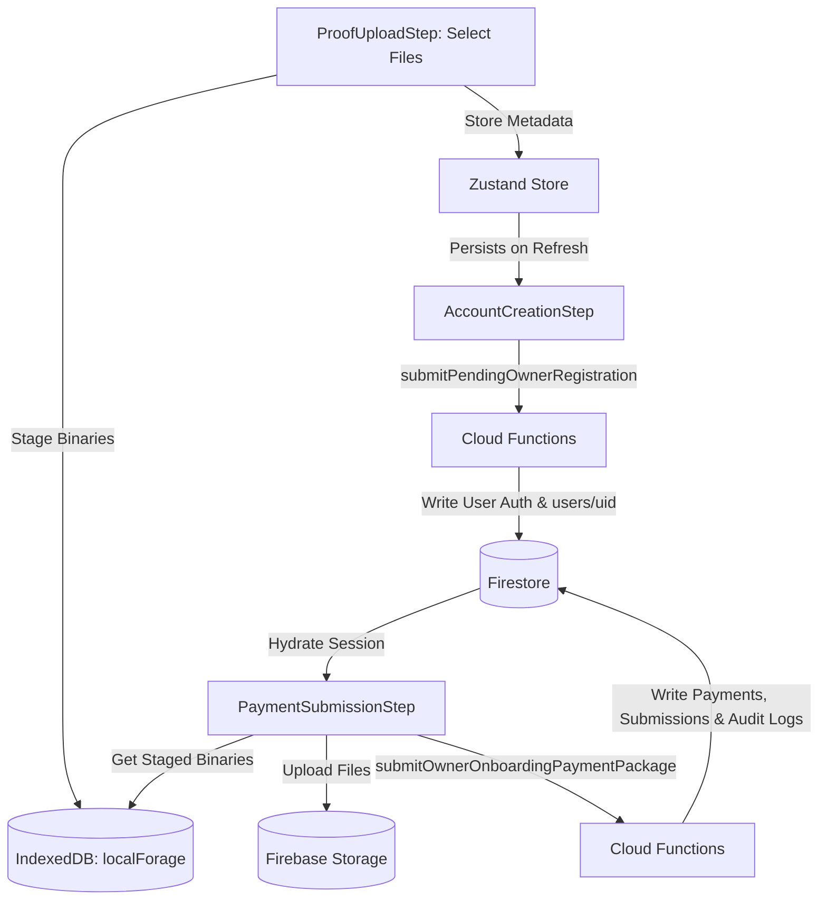

# Owner Onboarding Hardening & Architectural Verification Report

This report outlines the technical changes implemented to secure and stabilize the Owner Onboarding flow, eliminating state loss and enforcing backend validation.

## Architectural Changes

### 1. IndexedDB File Staging & Zustand De-serialization
- **Problem**: Storing raw JavaScript `File` objects in Zustand caused serialization errors and state wipes on page refresh during onboarding.
- **Solution**: Designed and implemented `src/lib/onboardingDb.ts` to stage file binaries in IndexedDB using `localforage`. In `ProofUploadStep.tsx`, file selections stage binaries to IndexedDB and write only plain metadata (`{ name, size, type }`) to Zustand.
- **Outcome**: The owner onboarding flow is 100% resilient to browser refreshes.

### 2. Client-Side Firestore Bypass & Cloud Function Callables
- **Problem**: Writing directly to protected collections (`intake_submissions`, `payment_transactions`, `audit_logs`) from the client app violated security rules and allowed potential data tampering.
- **Solution**:
  - Implemented the `submitOwnerOnboardingPaymentPackage` Cloud Function in `functions/ownerRegistrationRequest.ts` to handle transaction writes securely on the backend.
  - Refactored `PaymentSubmissionStep.tsx` to upload files to Firebase Storage first (retrieving the binaries from IndexedDB) and then invoke `submitOwnerOnboardingPaymentPackage` with file metadata and download URLs.
  - Ensured both `ownerId` and `ownerUid` fields are populated in all collections.
  - Cleaned up local staged binaries in IndexedDB via `clearStagedFiles()` upon successful submission.

### 3. Admin Panel Integration
- **Problem**: Admin Verification Inbox needed to support the new metadata-only states vs download URLs, and query new status types securely.
- **Solution**:
  - In `IntakeVaultPage.tsx`, updated the document listing to check if the value is a string (download URL) or an object (metadata-only). Added direct **OPEN / DOWNLOAD** buttons for links and a **Request Final Copies** label for metadata-only states.
  - In `PaymentApprovalsPage.tsx`, updated the firestore query status filters to include `'PENDING'`, `'pending_admin_verification'`, `'payment_pending_approval'`, and `'pending_approval'`.

---

## Verification Results

All local verification checks ran and passed successfully:
1. **Linter**: `npm run lint` exited cleanly (`code 0`).
2. **Frontend Compiles**: `npm run build` compiled production bundle successfully (`code 0`).
3. **Cloud Functions Compiles**: `npm run build` inside `functions/` completed with zero TypeScript errors (`code 0`).
4. **Security Rules Suite**: `npx firebase emulators:exec "npm run test:rules"` executed 7 tests with all tests passing successfully (`code 0`).
5. **Stability Guard Suite**: `npm run test:stability` passed successfully (`code 0`).
